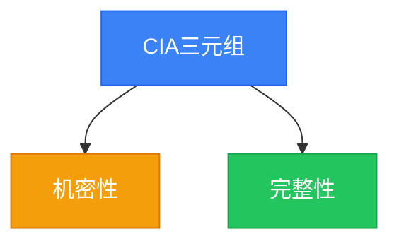

# 知识图谱使用指南

> 把零散的知识点连成网 — 了解依赖关系，找到学习路径，攻克薄弱点

---

## 什么是知识图谱？

知识图谱是 CISSP 8 大领域知识点之间的**关系网络**。

每个知识点不是孤立的：
- 学 B 之前得先掌握 A → **前置依赖**
- A 和 C 互相促进理解 → **相关关系**
- D 是 E 的一个组成部分 → **组成关系**

理解了这些关系，你就能：
- 🧭 知道该按什么顺序学（不会"学 B 但看不懂因为还不会 A"）
- 🔍 发现薄弱点的连锁影响（一个点弱可能拖垮一片）
- 🎯 找到最高效的学习路径（先补哪个薄弱点收益最大）
- 🗺️ 看到自己的知识全貌，哪里弱一目了然

---

## 图谱规模

| 维度 | 数量 |
|------|------|
| 领域 | 8 个 |
| 知识点 | 150+ 个（随题库增长） |
| 预设关系边 | 137 条 |
| 关系类型 | 3 种 |

### 三种关系类型

| 类型 | 符号 | 含义 | 示例 |
|------|------|------|------|
| **前置依赖** (prerequisite) | A → B | 学 B 必须先会 A | 加密基础 → 对称加密 → AES |
| **相关** (related) | A ↔ B | 互相促进理解 | 风险胃口 ↔ 风险容忍度 |
| **组成部分** (part_of) | A ⊂ B | A 是 B 的一部分 | CIA三元组 ⊃ 机密性 |

---

## 核心功能

### 1. 查看知识图谱

```bash
# 文本树格式（终端直接看）
cissp-trainer knowledge graph 1

# Mermaid 格式（Markdown 中渲染）
cissp-trainer knowledge graph 1 --mermaid
```

**文本树示例**：
```
🌳 安全与风险管理（22 个知识点）
└── 业务影响分析 ░░░░░░░░░░ 0%
└── 可用性 ░░░░░░░░░░ 0%
├── 安全基础概念 ░░░░░░░░░░ 0%
    └── CIA三元组 ░░░░░░░░░░ 0%
    ├── 治理 ░░░░░░░░░░ 0%
        └── 安全策略 ░░░░░░░░░░ 0%
        └── 高层管理责任 ░░░░░░░░░░ 0%
...
```

每个节点显示掌握度进度条，绿色越深掌握越好。

### 2. 查询前置依赖

"学这个知识点需要什么基础？"

```bash
cissp-trainer knowledge prereq "Bell-LaPadula"

# 指定领域（更快更准）
cissp-trainer knowledge prereq "加密算法" -d 3

# 控制递归深度（默认 3）
cissp-trainer knowledge prereq "RSA" -d 3 --depth 5
```

输出按层级展示，越往上越基础。

### 3. 推荐下一步学习

"我掌握了 A，接下来该学什么？"

```bash
cissp-trainer knowledge next "CIA三元组"
```

系统会找出所有 A 的后继知识点，筛选出"所有前置都已掌握但自身还没掌握"的点，按掌握度从低到高排列。

> 💡 这是最科学的学习顺序——每次学的都是"已经具备所有前置知识、现在学效率最高"的内容。

### 4. 薄弱点传播分析

"这个知识点薄弱，会影响哪些后续内容？"

```bash
cissp-trainer knowledge impact "加密基础"
```

按影响度从高到低列出所有受影响的后继知识点。

**影响度计算公式**：
```
影响度 = 源点薄弱程度 × 路径权重积 × (1 / 距离)
```

- 源点越薄弱，影响越大
- 距离越近，影响越大
- 关联越强，影响越大

### 5. 全领域掌握度热力图

```bash
cissp-trainer knowledge heatmap
```

用 emoji 色块直观展示 8 大领域所有知识点的掌握情况：

| 颜色 | 掌握度 | 含义 |
|------|--------|------|
| 🟩 | ≥ 90% | 精通 |
| 🟢 | 70-90% | 掌握 |
| 🟡 | 50-70% | 学习中 |
| 🟠 | 30-50% | 薄弱 |
| 🔴 | 0-30% | 很差 |
| ⬜ | 0% | 未学 |

---

## 实际应用场景

### 场景 1：刚入门，不知道从哪开始

```bash
# 从根节点（没有前置的基础概念）开始
cissp-trainer knowledge graph 1
# → 找到最顶层的基础概念，开始学
```

### 场景 2：学某个点学不懂

```bash
# 查它的前置知识，看是不是缺了基础
cissp-trainer knowledge prereq "非对称加密"
# → 如果前置的"加密基础"没学好，回去补
```

### 场景 3：想快速提分

```bash
# 找薄弱点的影响面
cissp-trainer knowledge impact "加密算法"
# → 如果影响面很大，先攻克这个点，性价比最高
```

### 场景 4：检验学习成果

```bash
# 全领域热力图，一眼看到哪里强哪里弱
cissp-trainer knowledge heatmap
```

### 场景 5：制定学习计划

```bash
# 学完 A 了，推荐下一步
cissp-trainer knowledge next "安全模型"
# → 系统推荐最适合现在学的后继知识点
```

---

## 图谱数据维护

### 预设数据

137 条预设关系存在 `data/yaml/knowledge_graph.yaml`，可以直接编辑补充。

格式：
```yaml
- domain: 1
  edges:
    - source: "安全基础概念"
      target: "CIA三元组"
      type: prerequisite     # prerequisite / related / part_of
      weight: 1.0            # 关联强度 0-1
      description: ""        # 可选说明
```

### 导入自定义图谱

```python
from cissp_trainer.knowledge_graph import import_preset_graph
from cissp_trainer.database import session_scope

my_graph = [
    {
        "domain": 1,
        "edges": [
            {"source": "我的知识点A", "target": "我的知识点B", "type": "prerequisite"},
        ]
    }
]

with session_scope() as s:
    result = import_preset_graph(s, my_graph)
    print(f"导入了 {result['added']} 条边")
```

### 通过 API 添加边

```python
from cissp_trainer.knowledge_graph import add_edge, remove_edge

# 添加
add_edge(session, "知识点A", "知识点B", domain=1, edge_type="related", weight=0.8)

# 删除
remove_edge(session, "知识点A", "知识点B", domain=1)
```

---

## 可视化输出

### Mermaid 流程图

`knowledge graph --mermaid` 输出 Mermaid 格式，可以在：
- GitHub Markdown（直接渲染）
- Obsidian（安装 Mermaid 插件）
- Notion（嵌入代码块）
- Mermaid Live Editor（在线编辑）

输出示例：


颜色含义：
- 🟢 绿色（mastered）：掌握度 ≥ 80%
- 🔵 蓝色（learning）：掌握度 50-80%
- 🟡 橙色（weak）：掌握度 0-50%
- ⬜ 灰色（notstarted）：掌握度 = 0%

---

## 算法说明

### 薄弱点传播

使用 BFS（广度优先搜索）遍历所有后继节点：

1. 从源点出发，沿前置依赖边反向遍历
2. 每条路径的影响度 = 薄弱程度 × 边权重积 × (1/距离)
3. 如果有多条路径到达同一个点，取影响度最大的那条
4. 按影响度降序输出

### 学习建议（suggest_next）

推荐逻辑：
1. 找到当前知识点的直接后继（深度 1）
2. 对每个后继点，检查它的**所有**前置是否都已掌握（≥ 70%）
3. 所有前置都已掌握 + 自身未掌握（< 70%）→ 列入推荐
4. 按自身掌握度从低到高排序（越低越该学）

这个逻辑保证了推荐的每个知识点都是"现在可以学、且学了就有用"的。
