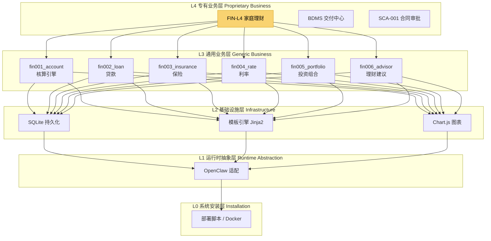
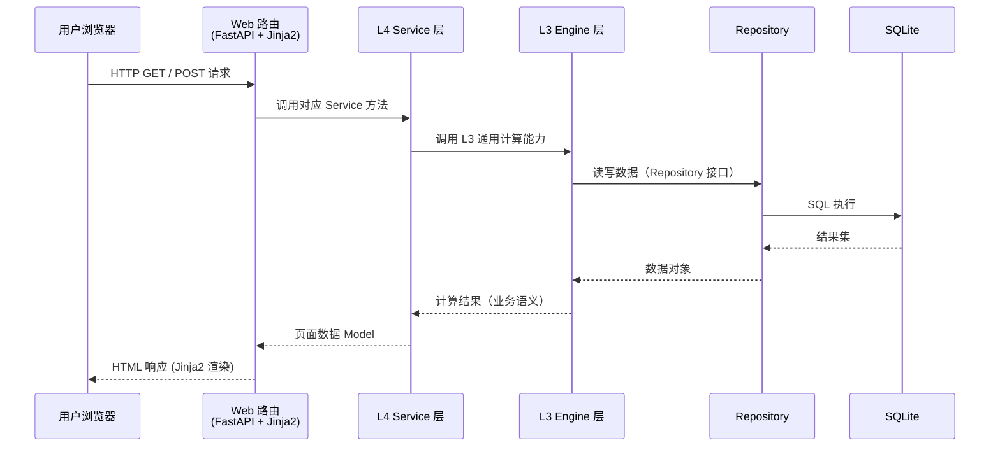
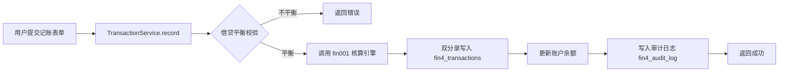
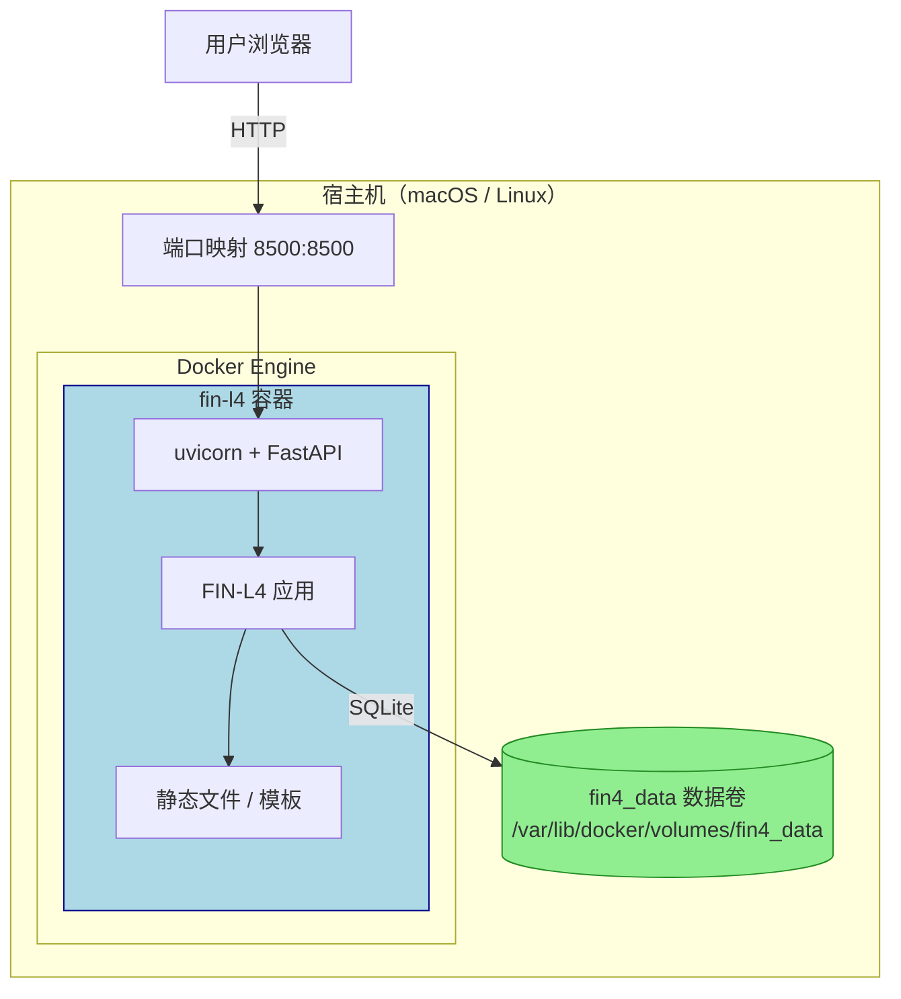
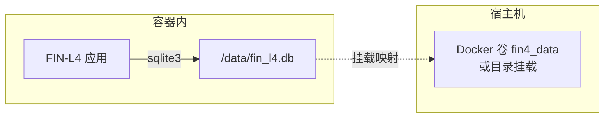

# FIN-L4 家庭理财管理系统 — 架构说明

> 版本：0.1.0 | 文档状态：active | 更新日期：2026-09-04
>
> 面向角色：开发 / 架构师 / 技术评审
>
> 配套文档：`../../docs/architecture/00-system-architecture.md`（全局 5 层架构）

---

## 1. FIN-L4 在全局架构中的定位

### 1.1 5 层架构全景



**定位说明**：
- FIN-L4 是 L4 专有业务层的一个垂直应用（家庭理财场景）
- 继承 L3 财务通用模块（fin001 ~ fin006）的全部能力
- 在 L3 之上叠加家庭专有逻辑：家庭 ID 隔离、家庭账本、家庭成员、家庭保障分析
- 运行时无关（ADR-012），不依赖 OpenClaw 运行时即可独立运行

---

## 2. FIN-L4 内部分层架构

### 2.1 系统分层架构图

```mermaid
graph TB
    subgraph Web层["Web 层（12 页面 + API）"]
        W1[dashboard 仪表盘]
        W2[accounts 账户管理]
        W3[transactions 记账]
        W4[budget 预算]
        W5[loans 贷款]
        W6[insurance 保险]
        W7[portfolio 投资]
        W8[advise 理财建议]
        W9[report 报表]
        W10[rates 利率]
        W11[import 导入]
        W12[settings 设置]
    end

    subgraph Service层["L4 Service 层（10 个服务）"]
        S1[account_svc]
        S2[txn_svc]
        S3[loan_svc]
        S4[insurance_svc]
        S5[rate_svc]
        S6[portfolio_svc]
        S7[advise_svc]
        S8[budget_svc]
        S9[report_svc]
        S10[import_svc]
        S11[export_svc]
        S12[category_engine]
    end

    subgraph L3Engine["L3 通用引擎层（6 模块）"]
        E1[fin001_account<br/>核算引擎]
        E2[fin002_loan<br/>贷款模块]
        E3[fin003_insurance<br/>保险模块]
        E4[fin004_rate<br/>利率模块]
        E5[fin005_portfolio<br/>投资组合]
        E6[fin006_advisor<br/>理财建议]
    end

    subgraph Repository层["Repository / DB 层"]
        R[fin_l4/db/repositories.py<br/>14 张表 CRUD]
    end

    subgraph DB层["数据层（SQLite）"]
        D[(fin_l4.db<br/>14 张 fin4_ 表)]
    end

    W1 & W2 & W3 & W4 & W5 & W6 & W7 & W8 & W9 & W10 & W11 & W12 --> S1 & S2 & S3 & S4 & S5 & S6 & S7 & S8 & S9 & S10 & S11

    S1 --> E1
    S2 --> E1
    S8 --> E1
    S9 --> E1
    S3 --> E2
    S4 --> E3
    S5 --> E4
    S6 --> E5
    S7 --> E6
    S10 --> E1
    S11 --> E1

    E1 & E2 & E3 & E4 & E5 & E6 --> R
    R --> D

    S12 --> S10
```



### 2.2 各层职责

| 层级 | 职责 | 关键文件 |
|---|---|---|
| **Web 层** | 页面渲染（Jinja2 模板）、路由、HTTP 处理 | `fin_l4/web/main.py`、`fin_l4/web/templates/` |
| **L4 Service 层** | 家庭场景业务编排、L3 引擎组合调用、专有规则 | `fin_l4/services/*.py` |
| **L3 通用引擎层** | 纯财务计算、通用业务逻辑、无场景感知 | `fin_l4/engine/`（概念层，代码内聚在 services） |
| **Repository 层** | 数据库 CRUD、SQL 封装、事务管理 | `fin_l4/db/repositories.py` |
| **数据层** | SQLite 持久化存储 | `~/.fin-l4/fin_l4.db` |

---

## 3. 数据流图

### 3.1 用户请求数据流



### 3.2 记账交易数据流（典型写操作）



---

## 4. 模块清单

### 4.1 L3 通用模块（6 个）

| 模块 | 代码标识 | 职责（一句话） |
|---|---|---|
| 核算引擎 | fin001_account | 借贷记账法核心：账户管理、交易记账、余额计算、试算平衡、报表生成 |
| 贷款模块 | fin002_loan | 贷款计算：还款计划、提前还款、等额本息/等额本金、贷款汇总 |
| 保险模块 | fin003_insurance | 保单管理、现金价值测算、保障缺口分析、退保模拟 |
| 利率模块 | fin004_rate | 利率快照存储、历史查询、LPR/存款/国债收益率管理 |
| 投资组合 | fin005_portfolio | 持仓管理、资产配置、再平衡建议、收益率计算 |
| 理财建议 | fin006_advisor | 财务健康评分、应急储备分析、负债健康度、配置建议 |

### 4.2 L4 Service 层（10 + 2 个）

| 服务 | 文件名 | 职责（一句话） |
|---|---|---|
| 账户服务 | `account_svc.py` | L4 账户 CRUD + 余额查询 + 试算平衡，调用 fin001 |
| 交易服务 | `txn_svc.py` | 记账交易录入、查询、分类，调用 fin001 |
| 贷款服务 | `loan_svc.py` | 家庭贷款管理 + 提前还款 + 结清，调用 fin002 |
| 保险服务 | `insurance_svc.py` | 家庭保单管理 + 保障缺口 + 退保，调用 fin003 |
| 利率服务 | `rate_svc.py` | 利率录入与查询，调用 fin004 |
| 投资组合服务 | `portfolio_svc.py` | 家庭投资组合 + 持仓 + 再平衡，调用 fin005 |
| 理财建议服务 | `advise_svc.py` | 财务健康体检 + 建议生成，调用 fin006 |
| 预算服务 | `budget_svc.py` | 分类预算设置、执行跟踪、超预算告警 |
| 报表服务 | `report_svc.py` | 资产负债表 / 利润表 / 现金流量表生成 |
| 导入服务 | `import_svc.py` | CSV 导入、字段映射、分类规则匹配 |
| 导出服务 | `export_svc.py` | 报表导出 Excel / Word |
| 分类引擎 | `category_engine.py` | 交易自动分类（关键字 + 规则引擎） |

### 4.3 Web 层（12 页面）

| 页面 | 路由 | 模板文件 | 用途 |
|---|---|---|---|
| 仪表盘 | `/` | `dashboard.html` | 财务总览 + 图表 |
| 账户管理 | `/accounts` | `accounts.html` | 账户增删改查 |
| 记账 | `/transactions` | `transactions.html` | 交易录入与查询 |
| 预算 | `/budget` | `budget.html` | 预算设置与跟踪 |
| 贷款列表 | `/loans` | `loans.html` | 贷款总览 |
| 贷款详情 | `/loans/{id}` | `loan_detail.html` | 还款计划 + 提前还款 |
| 保险列表 | `/insurance` | `insurance.html` | 保单总览 |
| 保险详情 | `/insurance/{id}` | `insurance_detail.html` | 保单详情 + 退保 |
| 保障缺口 | `/insurance/coverage-gap` | `coverage_gap.html` | 保障分析 |
| 投资列表 | `/portfolio` | `portfolio.html` | 组合总览 |
| 投资详情 | `/portfolio/{id}` | `portfolio_detail.html` | 持仓 + 配置 + 再平衡 |
| 理财建议 | `/advise` | `advise.html` | 财务体检 + 建议 |
| 报表 | `/report` | `reports.html` | 三大财务报表 |
| 利率 | `/rates` | `rates.html` | 利率管理 |
| 导入 | `/import` | `import.html` | CSV 导入 |
| 设置 | `/settings` | `settings.html` | 系统配置 |

### 4.4 数据库表（14 张，前缀 `fin4_`）

| 表名 | 用途 |
|---|---|
| `fin4_family` | 家庭信息（多租户隔离） |
| `fin4_accounts` | 账户表（5 大类） |
| `fin4_transactions` | 交易记录表（双分录） |
| `fin4_categories` | 收支分类表 |
| `fin4_budgets` | 预算表 |
| `fin4_loans` | 贷款主表 |
| `fin4_insurance_policies` | 保单表 |
| `fin4_portfolios` | 投资组合表 |
| `fin4_holdings` | 持仓明细表 |
| `fin4_rate_snapshots` | 利率快照表 |
| `fin4_integrations` | 外部系统链接（只读） |
| `fin4_audit_log` | 审计日志 |
| `fin4_security_config` | 安全配置 |
| `fin4_import_rules` | 导入规则表 |

---

## 5. 关键设计决策

### 5.1 借贷记账法（Double-Entry Bookkeeping）

**决策**：采用标准借贷记账法，每笔交易同时记录借方和贷方。

**理由**：
- 会计恒等式 `资产 = 负债 + 权益` 保证数据一致性
- 支持完整的财务报表生成（资产负债表/利润表/现金流量表）
- 与专业财务系统对齐，未来扩展能力强

**实现要点**：
- 所有金额使用 `Decimal` 类型，精度 28 位
- 交易写入时强制校验借贷平衡
- 试算平衡工具可随时校验全账一致性

### 5.2 Decimal 精度

**决策**：所有金额计算使用 Python `decimal.Decimal`，**严禁使用 float**。

**理由**：
- 浮点数精度问题在财务计算中不可接受（如 `0.1 + 0.2 != 0.3`）
- Decimal 支持精确的舍入控制（`ROUND_HALF_UP` 等）
- SQLite 存储为 TEXT，读取时转回 Decimal，无损

**实现要点**：
- 统一使用 `Decimal("0.01")` 作为精度基准
- 除法使用 `quantize(Decimal("0.01"), rounding=ROUND_HALF_UP)`
- 所有 Service 层出入参均为 Decimal

### 5.3 SQLite 选型

**决策**：使用 SQLite 作为唯一数据库，不引入 MySQL/PostgreSQL。

**理由**：

| 维度 | SQLite 优势 | 为什么适合家庭理财 |
|---|---|---|
| 部署 | 零配置，单文件 | 家庭用户无需运维数据库 |
| 性能 | 本地读写极快（<1ms） | 单家庭并发极低，性能完全过剩 |
| 备份 | 拷贝文件即可 | 普通人也能备份 |
| 可移植 | 跨平台，无依赖 | macOS / Linux / Docker 都能用 |
| 事务 | 支持 ACID + WAL | 财务数据一致性有保障 |

**局限与应对**：
- 不支持高并发写入 → 家庭场景单用户写入，无压力
- 不支持网络访问 → 本地优先设计，网络访问通过 Web 层
- 无用户权限系统 → 当前版本单家庭使用，通过部署环境隔离

### 5.4 单端口原则

**决策**：整个 FIN-L4 系统只占用一个端口（默认 8500），前后端一体化。

**理由**：
- 部署简单，用户只需记住一个地址
- 避免跨域问题（API 与页面同源）
- 减少攻击面
- 符合单进程设计原则

**实现**：
- FastAPI 同时提供页面路由（HTML）和 API 路由（JSON）
- 静态文件通过 `/static/` 路径服务
- 全部走 uvicorn 单进程

### 5.5 零外部依赖（Zero External Dependency）

**决策**：系统不连接任何外部金融 API，不自动同步数据。

**理由**：
- **安全**：不存储银行/券商凭据，无泄露风险
- **合规**：不涉及金融数据爬取/聚合的法律灰色地带
- **稳定**：不依赖第三方服务可用性
- **可控**：用户完全掌握自己的数据

**实现**：
- 数据录入全部手动 + CSV 导入
- 外部系统链接为只读跳转（`FIN4_EXTERNAL_READONLY=1`）
- 不调用任何外部 API

---

## 6. 接口契约：L3 ↔ L4 边界

### 6.1 分层原则

```
L4 调用 L3 → 允许（继承通用能力）
L3 调用 L4 → 禁止（反向依赖）
L3 感知家庭概念 → 禁止（L3 是通用的，不感知场景）
```

### 6.2 边界示例

以贷款模块为例：

**L3 fin002_loan 提供**（纯计算，无场景）：
```python
# 生成还款计划（纯函数）
def generate_schedule(principal: Decimal, rate: Decimal, 
                      months: int, method: str) -> list[dict]

# 计算提前还款后的新计划
def prepay(schedule: list[dict], period: int, 
           amount: Decimal, mode: str) -> dict

# 贷款汇总
def summarize(schedule: list[dict]) -> dict
```

**L4 loan_svc 提供**（家庭场景编排）：
```python
# 家庭维度：为某家庭创建贷款
def create_loan(family_id: str, loan_data: dict) -> dict

# 持久化 + 计算：获取贷款还款计划
def get_schedule(loan_id: str) -> list[dict]

# 执行提前还款（更新数据库 + 重算计划 + 审计）
def execute_prepay(loan_id: str, amount: str) -> dict

# 结清贷款（标记状态 + 生成最终报表）
def close_loan(loan_id: str) -> None
```

### 6.3 契约约束

| 约束 | 说明 |
|---|---|
| L3 纯逻辑 | L3 模块只做计算和逻辑判断，不直接访问 DB |
| L4 编排 | L4 Service 负责流程编排、数据持久化、审计日志 |
| Repository 共享 | DB 访问通过 Repository 层，L3/L4 共用 |
| 家族 ID 隔离 | L4 所有查询带 `family_id`，L3 不感知此字段 |
| 错误码规范 | L3 抛 `ValueError` / `ArithmeticError`；L4 包装为业务异常 |

---

## 7. 部署架构

### 7.1 Docker 部署架构



### 7.2 部署方式对比

| 维度 | Docker 部署 | systemd 裸机 | launchd 裸机 |
|---|---|---|---|
| 适用系统 | 所有支持 Docker 的系统 | Linux | macOS |
| 隔离性 | 容器级隔离 | 进程级 | 进程级 |
| 升级方式 | `docker compose up -d --build` | `git pull` + 重启服务 | `git pull` + 重新加载 |
| 数据位置 | Docker 命名卷 `fin4_data` | `~/.fin-l4/` | `~/.fin-l4/` |
| 自愈能力 | `--restart unless-stopped` | `Restart=on-failure` | `KeepAlive=true` |
| 端口暴露 | `-p 8500:8500` | 直接监听 | 直接监听 |
| 推荐场景 | 生产 / 服务器 | Linux 桌面 / 服务器 | macOS 长期运行 |

### 7.3 数据持久化



- 数据库文件：容器内 `/data/fin_l4.db`
- 升级容器**不影响**数据（卷独立于容器生命周期）
- 备份 = 备份卷 / 备份文件

---

## 8. 扩展点

### 8.1 业务模块扩展

| 扩展方向 | 接入位置 | 说明 |
|---|---|---|
| 税务管理 | L3 新增 fin007_tax + L4 tax_svc + /tax 页面 | 个税计算、税务优化 |
| 房产管理 | L4 realestate_svc + /realestate 页面 | 房产估值、房贷联动 |
| 教育金规划 | L4 education_svc + /education 页面 | 目标导向储蓄规划 |
| 退休规划 | L4 retirement_svc + /retirement 页面 | 养老金测算 |
| 多币种支持 | L3 新增 fin008_currency | 汇率、外币账户 |

### 8.2 技术扩展

| 扩展方向 | 接入位置 | 说明 |
|---|---|---|
| 多用户鉴权 | Web 层 middleware + users 表 | 当前无登录，可加 Basic Auth / OAuth |
| 移动端适配 | templates/ 响应式改造 + PWA | 当前仅桌面端 |
| 数据同步 | 新增 sync 模块 + 云端数据库 | 当前纯本地，可加端到端加密同步 |
| API 开放 | 现有 API 路由 + Token 鉴权 | 供第三方 App 调用 |
| 消息通知 | L2 notification 组件 + 邮件/推送 | 预算告警、账单提醒 |

### 8.3 架构演进路径

```
v0.1（当前）          v0.2                v1.0                v2.0
单家庭 · 本地         多家庭 · 多用户      移动端 · 云同步       开放平台
12 页面 · SQLite      鉴权 · 多租户        PWA · 端到端加密      API · 插件市场
```

---

*文档结束 — 全局架构参考 `../../docs/architecture/00-system-architecture.md`*
