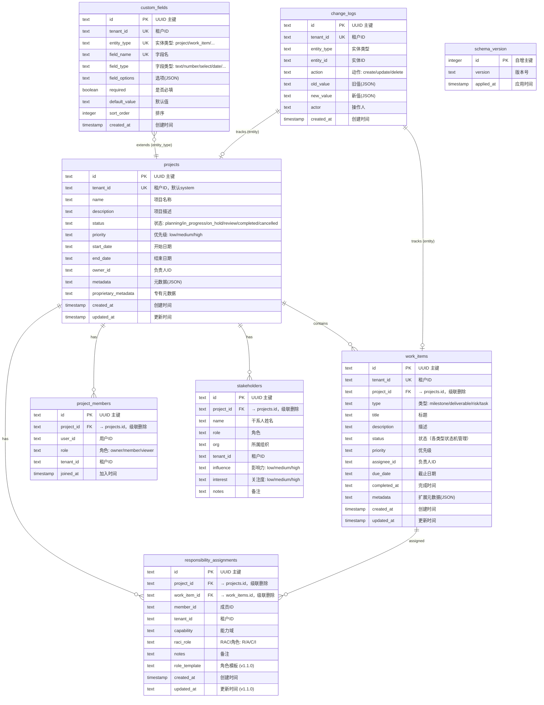

# 实体关系图

基于 `dms-framework/core/migrations.py` v1.0.0 + v1.1.0 实际 DDL 生成。

## ER 图（Mermaid）

## 表清单

| 表名 | 用途 | 主键 | 外键数 | 版本 |
|------|------|------|--------|------|
| `schema_version` | Schema 版本追踪 | id (INTEGER AUTOINCREMENT) | 0 | 1.0.0 |
| `projects` | 项目主表 | id (TEXT UUID) | 0 | 1.0.0 |
| `work_items` | 统一工作项表（里程碑/交付物/风险/任务） | id (TEXT UUID) | 1 → projects | 1.0.0 |
| `project_members` | 项目成员 | id (TEXT UUID) | 1 → projects | 1.0.0 |
| `stakeholders` | 干系人 | id (TEXT UUID) | 1 → projects | 1.0.0 |
| `custom_fields` | 自定义字段元数据 | id (TEXT UUID) | 0 | 1.0.0 |
| `responsibility_assignments` | RACI 职责分配 | id (TEXT UUID) | 2 → projects, work_items | 1.0.0 + 1.1.0 |
| `change_logs` | 变更日志 | id (TEXT UUID) | 0 (逻辑关联) | 1.0.0 |

## 核心关系说明

### 1. 项目 → 工作项（一对多）
- `work_items.project_id` → `projects.id`，`ON DELETE CASCADE`
- 通过 `type` 字段区分：`milestone` / `deliverable` / `risk` / `task`
- 统一表设计（借鉴 GitHub Issues 模式），减少表数量

### 2. 项目 → 成员（一对多）
- `project_members.project_id` → `projects.id`，`ON DELETE CASCADE`
- 唯一约束：`UNIQUE(project_id, user_id)`

### 3. 项目 → RACI 分配（一对多）
- `responsibility_assignments.project_id` → `projects.id`
- `responsibility_assignments.work_item_id` → `work_items.id`（可空，空则为项目级）
- 唯一约束：`UNIQUE(project_id, work_item_id, member_id, capability)`

### 4. 自定义字段（元数据驱动）
- 参考 Salesforce Custom Field 模式
- 唯一约束：`UNIQUE(tenant_id, entity_type, field_name)`
- 字段值存储于各实体的 `metadata` JSON 字段中

## 索引清单

| 表 | 索引名 | 字段 | 用途 |
|----|--------|------|------|
| projects | idx_projects_tenant | tenant_id | 租户过滤 |
| work_items | idx_work_items_tenant | tenant_id | 租户过滤 |
| work_items | idx_work_items_project | project_id | 项目查询 |
| work_items | idx_work_items_type | type | 类型过滤 |
| work_items | idx_work_items_status | status | 状态过滤 |
| project_members | idx_project_members_tenant | tenant_id | 租户过滤 |
| stakeholders | idx_stakeholders_tenant | tenant_id | 租户过滤 |
| custom_fields | idx_custom_fields_tenant | tenant_id, entity_type | 租户+实体查询 |
| responsibility_assignments | idx_raci_tenant | tenant_id | 租户过滤 |
| responsibility_assignments | idx_raci_project | project_id | 项目查询 |
| change_logs | idx_change_logs_tenant | tenant_id | 租户过滤 |
| change_logs | idx_change_logs_entity | entity_type, entity_id | 变更历史查询 |

## 设计特点

1. **单租户兼容多租户**：所有表含 `tenant_id`，默认 `'system'`，单租户模式透明
2. **统一工作项表**：里程碑/交付物/风险/任务共用 `work_items`，通过 `type` 区分
3. **JSON 扩展字段**：`metadata` + `proprietary_metadata` 应对个性化需求
4. **级联删除**：项目删除时级联删除所有子资源
5. **变更审计**：`change_logs` 统一记录所有实体的变更历史
