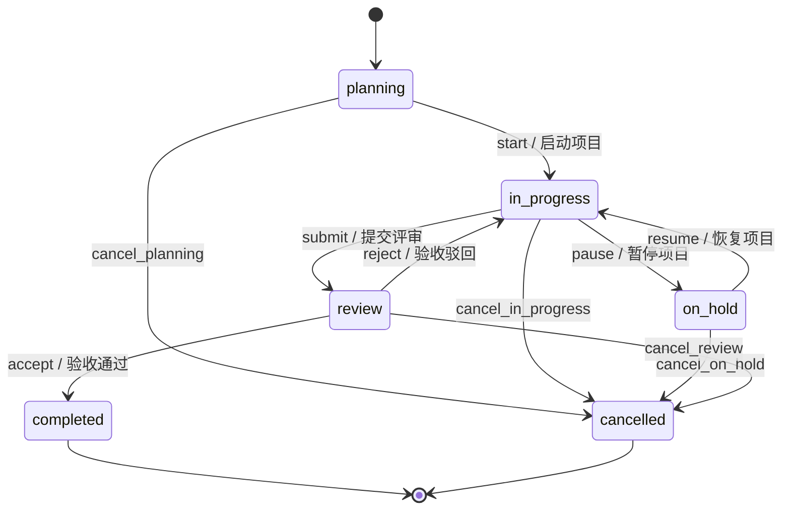
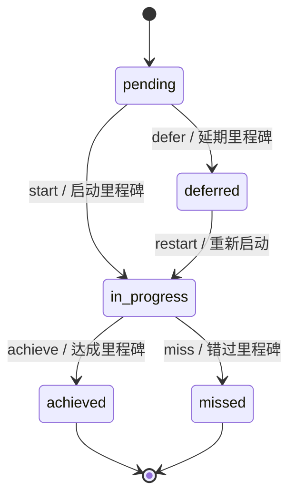
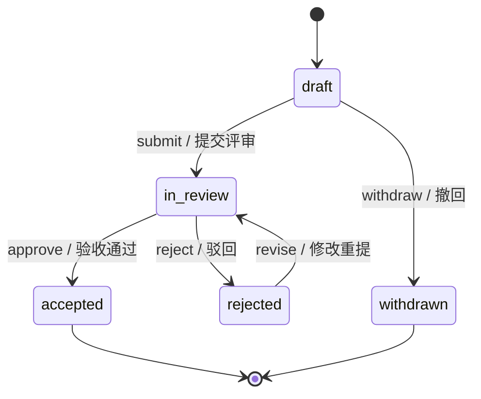
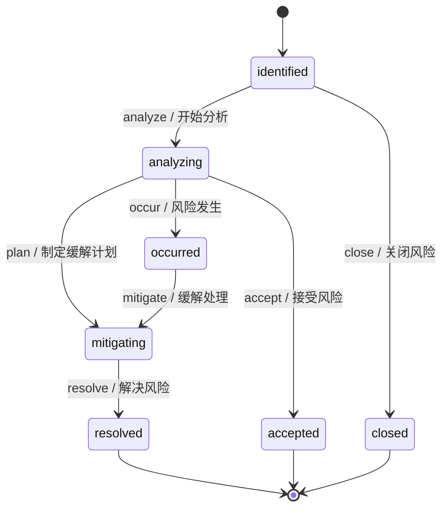

# 状态机定义

DMS 框架核心实体均通过状态机管理生命周期。以下状态机定义均来自实际代码。

## 1. 项目状态机 (Project)

**模块**：`modules/project/__init__.py` · **初始状态**：`planning`

### 状态列表

| 状态 | 分类 | 终态 | 说明 |
|------|------|------|------|
| `planning` | todo | 否（起始） | 规划中 |
| `in_progress` | in_progress | 否 | 进行中 |
| `on_hold` | blocked | 否 | 暂停中 |
| `review` | in_progress | 否 | 评审中 |
| `completed` | done | ✅ 终态 | 已完成 |
| `cancelled` | cancelled | ✅ 终态 | 已取消 |

### 迁移列表

| 迁移名 | 源状态 | 目标状态 | 说明 |
|--------|--------|----------|------|
| `start` | planning | in_progress | 启动项目 |
| `pause` | in_progress | on_hold | 暂停项目 |
| `resume` | on_hold | in_progress | 恢复项目 |
| `submit` | in_progress | review | 提交评审 |
| `accept` | review | completed | 验收通过 |
| `reject` | review | in_progress | 验收驳回 |
| `cancel_*` | planning/in_progress/on_hold/review | cancelled | 从任意非终态取消 |

### 特殊规则

- **cancel 聚合**：外部统一调用 `cancel`，内部根据当前状态映射为 `cancel_<state>`
- **终态事件**：`completed` 触发 `project.completed`，`cancelled` 触发 `project.cancelled`
- **级联效应**：项目取消 → 里程碑置为 missed/deferred → 交付物草稿撤回 → 风险关闭

---

## 2. 里程碑状态机 (Milestone)

**模块**：`modules/milestone/__init__.py` · **初始状态**：`pending`

### 状态列表

| 状态 | 分类 | 终态 | 说明 |
|------|------|------|------|
| `pending` | todo | 否（起始） | 待开始 |
| `in_progress` | in_progress | 否 | 进行中 |
| `achieved` | done | ✅ 终态 | 已达成 |
| `missed` | cancelled | ✅ 终态 | 已延期错过 |
| `deferred` | blocked | ✅ 终态 | 已延期 |

### 迁移列表

| 迁移名 | 源状态 | 目标状态 | 说明 |
|--------|--------|----------|------|
| `start` | pending | in_progress | 启动里程碑 |
| `achieve` | in_progress | achieved | 达成里程碑 |
| `miss` | in_progress | missed | 错过里程碑 |
| `defer` | pending | deferred | 延期里程碑 |
| `restart` | deferred | in_progress | 重新启动延期的里程碑 |

### 事件联动

- `project.cancelled` → `pending` 里程碑 `defer`，`in_progress` 里程碑 `miss`
- `achieved` 触发 `milestone.achieved`
- `missed` 触发 `milestone.missed`

---

## 3. 交付物状态机 (Deliverable)

**模块**：`modules/deliverable/__init__.py` · **初始状态**：`draft`

### 状态列表

| 状态 | 分类 | 终态 | 说明 |
|------|------|------|------|
| `draft` | todo | 否（起始） | 草稿 |
| `in_review` | in_progress | 否 | 评审中 |
| `accepted` | done | ✅ 终态 | 已验收 |
| `rejected` | blocked | 否 | 被驳回 |
| `withdrawn` | cancelled | ✅ 终态 | 已撤回 |

### 迁移列表

| 迁移名 | 源状态 | 目标状态 | 说明 |
|--------|--------|----------|------|
| `submit` | draft | in_review | 提交评审 |
| `approve` | in_review | accepted | 验收通过 |
| `reject` | in_review | rejected | 驳回 |
| `revise` | rejected | in_review | 修改重提 |
| `withdraw` | draft | withdrawn | 撤回 |

### 事件联动

- `project.cancelled` → 所有 `draft` 交付物自动 `withdraw`
- `accepted` 触发 `deliverable.accepted`
- `rejected` 触发 `deliverable.rejected`
- 里程碑关联通过 `metadata.parent_id` 存储（软关联）

---

## 4. 风险状态机 (Risk)

**模块**：`modules/risk/__init__.py` · **初始状态**：`identified`

### 状态列表

| 状态 | 分类 | 终态 | 说明 |
|------|------|------|------|
| `identified` | todo | 否（起始） | 已识别 |
| `analyzing` | in_progress | 否 | 分析中 |
| `mitigating` | in_progress | 否 | 缓解中 |
| `occurred` | blocked | 否 | 风险已发生 |
| `resolved` | done | ✅ 终态 | 已解决 |
| `accepted` | done | ✅ 终态 | 已接受 |
| `closed` | cancelled | ✅ 终态 | 已关闭 |

### 迁移列表

| 迁移名 | 源状态 | 目标状态 | 说明 |
|--------|--------|----------|------|
| `analyze` | identified | analyzing | 开始分析 |
| `plan` | analyzing | mitigating | 制定缓解计划 |
| `resolve` | mitigating | resolved | 解决风险 |
| `occur` | analyzing | occurred | 风险发生 |
| `mitigate` | occurred | mitigating | 缓解处理 |
| `accept` | analyzing | accepted | 接受风险 |
| `close` | identified | closed | 关闭风险 |

### 事件联动

- `project.cancelled` → `identified` 状态风险自动 `close`
- `resolved` 触发 `risk.resolved`
- `occurred` 触发 `risk.occurred`
- 风险属性（probability/impact/risk_score）存储于 `metadata` JSON

---

## 状态机架构特点

1. **统一引擎**：所有状态机注册到 `StateMachineEngine`，按名称查找
2. **事件驱动**：每次状态迁移发布 `*.status_changed` 事件，终态额外发布专项事件
3. **级联处理**：项目状态变更通过事件总线触发子资源自动迁移
4. **上下文传递**：迁移时可传递 `context` dict，含 tenant_id、reason 等信息
5. **分类映射**：每个状态有 `category` 属性（todo/in_progress/done/blocked/cancelled），用于看板视图统一分组
